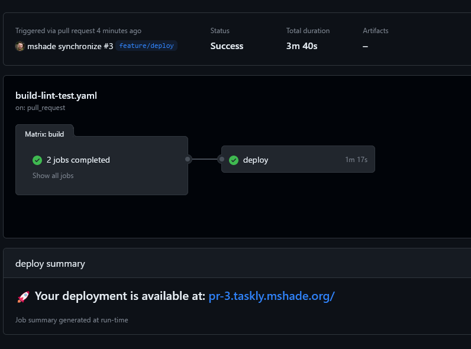

# Taskly - CI/CD

Containerizing and deploying the Taskly app!

## Summary in Brief

My approach to containerizing and deploying this 2 tier app was a 4 phase process which loosely correlates to the PRs merged to `main`.

1. Get it running locally to kick the tires.
    * I started with a barebones `docker-compose.yaml` and a minimal `Dockerfile` for each component to quickly iterate.
    * Determined how the frontend and backend communicate
    * Examined the existing lint/test/build tasks

2. Formalize the `Dockerfile` for each component and set up Github action workflow for Lint/Test/Build.
    * Use multi-stage build patterns and minimal images to improve build caches and
        allow running linting, tests, and build without having to install the same dependencies multiple times.
    * build components in parallel
    * Use the `ghcr.io` registry built into Github to distribute the application
    * Normalize test and linting invocation so the same CI commands work against each component

3. Choose a cloud provider and spin up a small Kubernetes cluster for hosting
    * Linode was selected for its simplicty and generous free hosting credits on new accounts
    * Kubernetes was chosen because:
        - it allows for easily hosting multiple instances of the application
        - after initial provisioning, deployments are extremely quick
    * I used the Linode Terraform provider with Terraform cloud to provision the cluster and an ingress for traffic handling
    

4. Create Kubernetes manifests and pipeline logic to deploy from `main` and for Pull Requests.
    * I defaulted to simplicity with plain deployment manifests and `kubectl`
    * Pipeline variables and `envsubst` are combined to customize deployments for each environment
    * Deploy `main` to a prod namespace available at [http://prod.taskly.mshade.org]
    * Deploy Pull Requests to PR namespaces, ex: [http://pr-3.taskly.mshade.org/]

## CI Workflow Detail

Added in [PR1](https://github.com/mshade/assessment-ie3/pull/1), the [linting, testing, and build workflow](.github/workflows/build-lint-test.yaml) runs in parallel for each component using matrix builds.

First, a `test` variant of each component is built. In this step, production dependencies are first installed into a `deps` stage in each [Dockerfile](./frontend/Dockerfile), followed by the full `npm install` in a `test` stage which includes dev and testing tools. This avoids having to re-install dependencies later for deployable builds.

Second, the `test` container image of each component runs:
* type-checks
* linting
* testing, if applicable

Next, the workflow authorizes against `ghcr.io` and uses the marketplace [`docker/metadata-action`](https://github.com/docker/metadata-action#about) to extract useful information for image tagging.

Finally, if all has succeeded so far, the [`docker/build-push-action`](https://github.com/docker/build-push-action#about) performs the final build and pushes to `ghcr.io`.

Built images are publicly available at [this repository's Packages tab](https://github.com/mshade?tab=packages&repo_name=assessment-ie3)

## Infrastructure Deployment Detail

Added in [PR2](https://github.com/mshade/assessment-ie3/pull/2), the [`infra-plan`](.github/workflows/infra-plan.yaml) and [`infra-apply`](.github/workflows/infra-apply.yaml) workflows use Terraform Cloud to plan and apply changes against the Linode API. This is a nice reference implementation for Github Actions from [Terraform Cloud documentation](https://github.com/hashicorp/tfc-workflows-github/tree/main#starter-workflow-templates) which provides feedback within PRs on Plan output so it can be inspected pre-merge / apply.

The [terraform configuration](deploy/tf) is concise and consists of:
* State configuration for the Terraform Cloud backend
* Provider configuration to deploy infrastructure in Linode 
* A simple Kubernetes cluster definition
* A basic `ingress-nginx` deployment (which in turn deploys a Linode Node Balancer) for traffic routing
* A `taskly_kubeconfig` output to use for Kubernetes API calls

The end result is that Pull Requests will test changes against Linode, and merging that PR will apply the new configuration.

Changes unrelated to the `./deploy/tf` directory will not invoke a plan or apply.

## Kubernetes Deployment Detail

[PR3](https://github.com/mshade/assessment-ie3/pull/3) added the app deployment steps. Deployment logic resides at the end of the [`build-lint-test.yaml`](.github/workflows/build-lint-test.yaml#L84) workflow so it can easily inherit variables from the build stages.

To avoid a manual step of exporting the Linode `KUBECONFIG` file as a repository secret manually, `terraform output` is used with Terraform Cloud to pull the `taskly_kubeconfig` from the current state.

[Kubernetes manifests at `deploy/k8s`](deploy/k8s/) define a `service` and `deployment` for each Taskly component, and an `ingress` for traffic routing. The `ingress` ties the `/api` path to the backend, and `/` to the frontend.

Variables from the earlier build metadata step populate the desired image tag and derive a namespace and hostname for the ingress. A simple `envsubst` and `kubectl apply` are used to apply the customized manifests.

Upon successful deployment, the Github Action job Summary will point you at your deployed Prod (main) or PR build!

## Future Additions / Improvements

Given the limited time for this assignment, there are a number of improvements to implement for the real world:

* The `KUBECONFIG` file is pulled from Terraform state and saved to a temporary file during the deployment run. To avoid leaking credentials, the config could be added as a Github repository secret and handled using a native action rather than `kubectl`, or pull model like GitOps deployment with ArgoCD could be used.
* HTTPS for our ingress
* The Kubernetes deploments should include liveness and readiness probes and declare resource requests and limits for resiliency
* Github's Environments feature could be used to track deployed environments
* A workflow that runs on PR close could be used to prune old ephemeral PR environments
* Dependabot for staying on top of dependencies
* A container security scanner [like Trivy](https://github.com/aquasecurity/trivy#readme) for pre-deploy sanity checks
* CODEOWNERS and merge restrictions should be added for more sensitive resources like terraform config to require tests to pass and approval before merging to main
* A 3 tier deployment environment could be implemented using release tags for production, main for staging, and PRs for feature testing environments.

## Thank you!

Thanks for taking a look at my work! I hope my choices and implementation make sense and demonstrate how I approach building and deploying applications.
